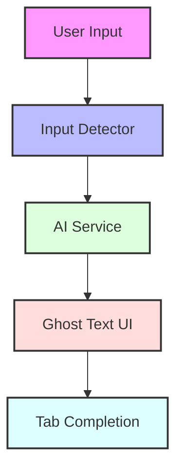
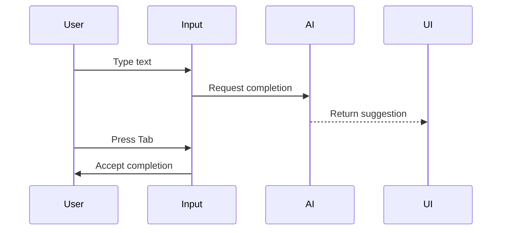
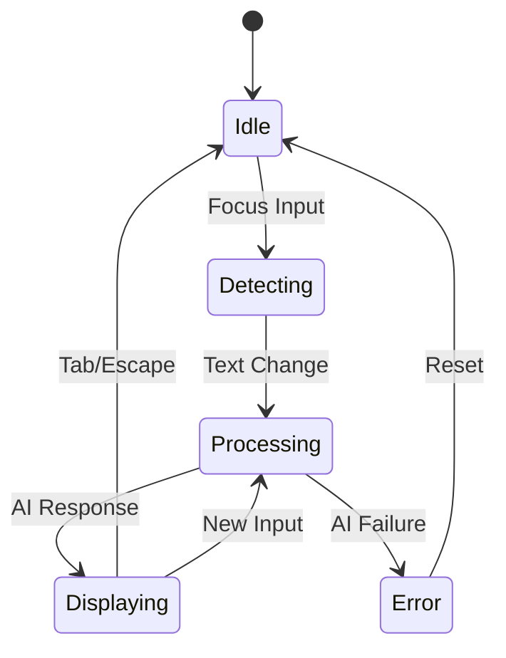
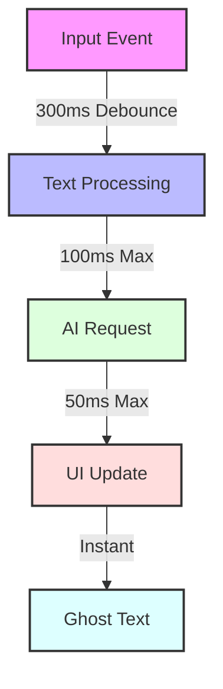
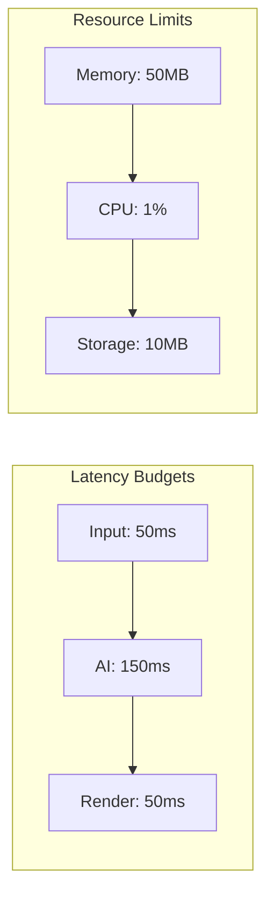
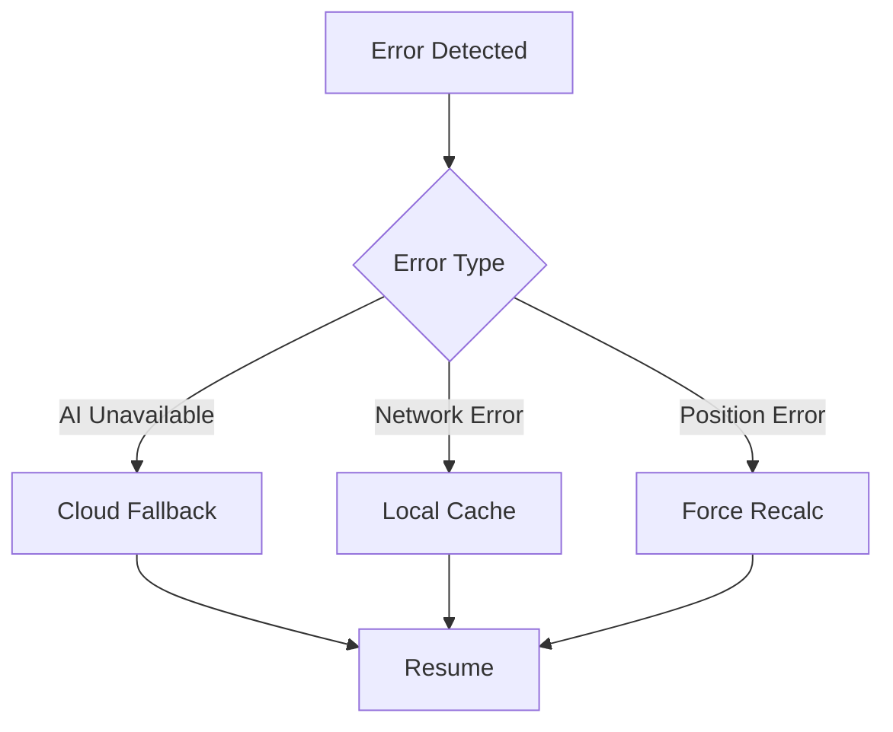
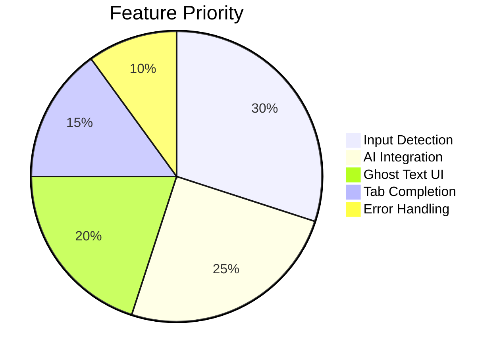

# GhostType AI - System Architecture

## System Overview



## Component Architecture

```mermaid
graph LR
    subgraph Content Script
        A[Input Detector] --> B[Ghost Text]
        B --> C[Position Engine]
    end

    subgraph AI Layer
        D[Gemini Nano] --> E[Text Generation]
        E --> F[Error Fallback]
    end

    subgraph UI Layer
        G[React Portal] --> H[Shadow DOM]
        H --> I[Style Sync]
    end

    Content Script --> AI Layer
    AI Layer --> UI Layer
```

## Data Flow



## State Machine



## Critical Paths



## Performance Targets



## Error Handling



## MVP Scope



## Core Components

### 1. Content Script Layer (Essential)

```typescript
interface InputDetector {
  activeElement: HTMLElement | null;
  inputSelectors: string[];

  initialize(): void;
  cleanup(): void;
  handleInputChange(element: HTMLElement): void;
}
```

Key MVP features:

- Basic DOM monitoring for text inputs
- Input element detection
- Cursor position tracking

### 2. UI Layer (Minimal)

```typescript
interface GhostTextProps {
  suggestion: string;
  position: {
    top: number;
    left: number;
  };
  style: {
    font: string;
    color: string;
  };
}
```

MVP features:

- Basic text overlay positioning
- Font matching
- Simple portal-based rendering

### 3. AI Integration (Core)

```typescript
interface AIService {
  model: "gemini-nano";
  generateCompletion(context: string): Promise<string>;
}
```

MVP features:

- Basic Gemini Nano integration
- Simple text completion
- Error fallback to cloud API

## Performance (MVP Focus)

### 1. Basic Debouncing

```typescript
const debouncedUpdate = debounce((text: string) => {
  requestCompletion(text);
}, 300);
```

### 2. Simple Context

```typescript
const getContext = (element: HTMLElement): string => {
  const text = element.value || element.textContent;
  const cursorPos = getCursorPosition(element);
  return text.substring(Math.max(0, cursorPos - 100), cursorPos);
};
```

## MVP Browser Support

- Chrome only (initial release)
- Basic textarea and input[type="text"] support
- Simple undo/redo via browser native support

## Security (Essential Only)

- Input sanitization
- Basic CSP compliance
- Local processing preference

## Error Handling (MVP)

```typescript
const handleError = async (error: Error) => {
  console.error(error);
  fallbackToCloud();
};
```

## Future Considerations (Post-MVP)

- Cross-browser support
- Advanced text positioning
- Caching system
- Plugin system
- Custom models
- Advanced UI components with shadcn/ui
