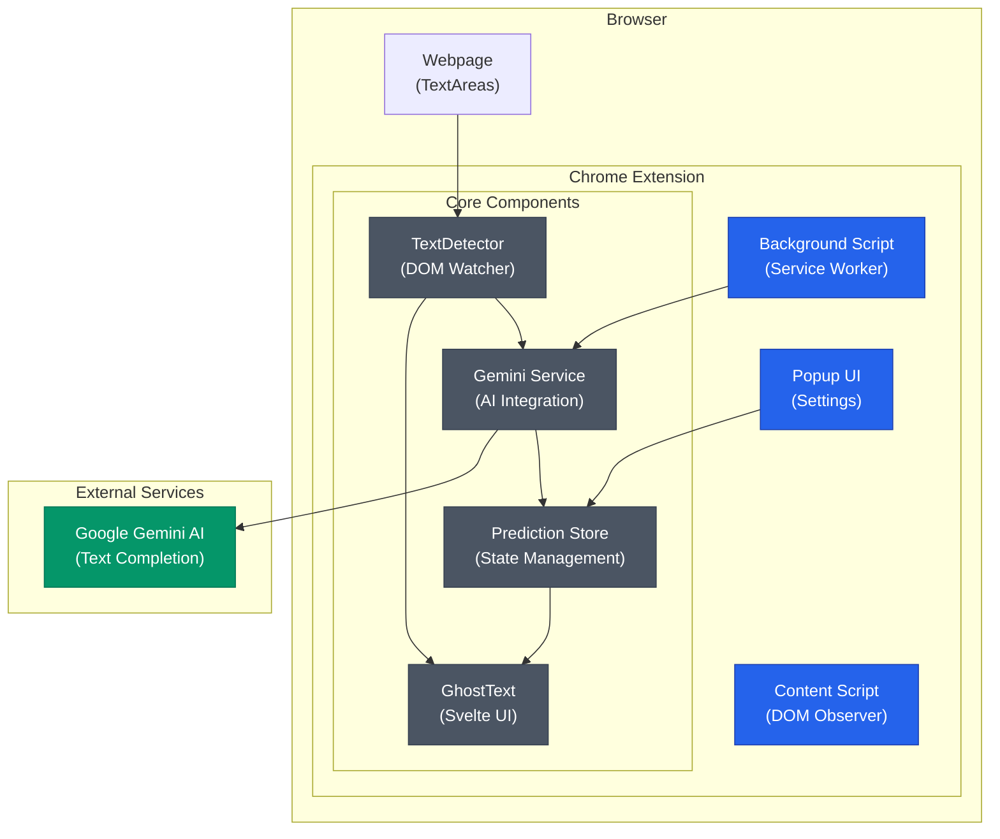
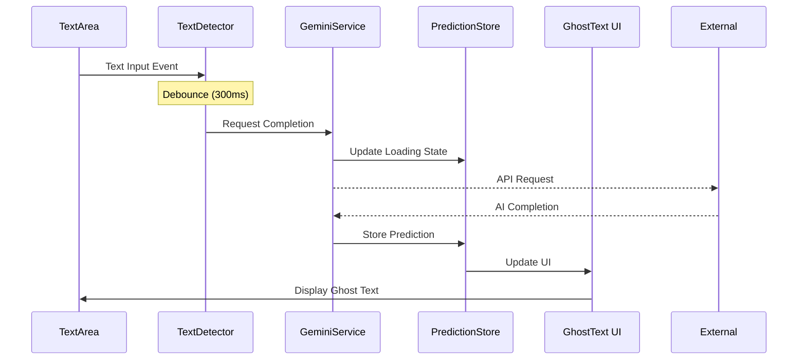
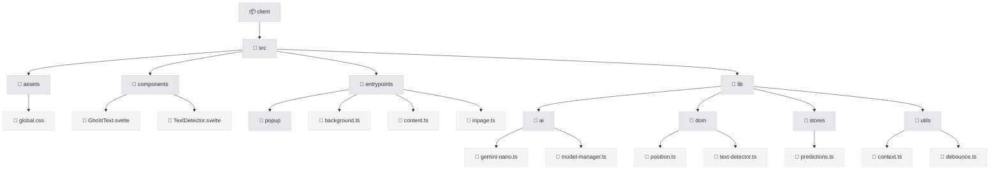
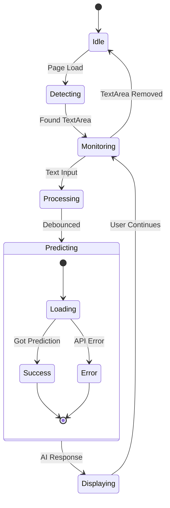
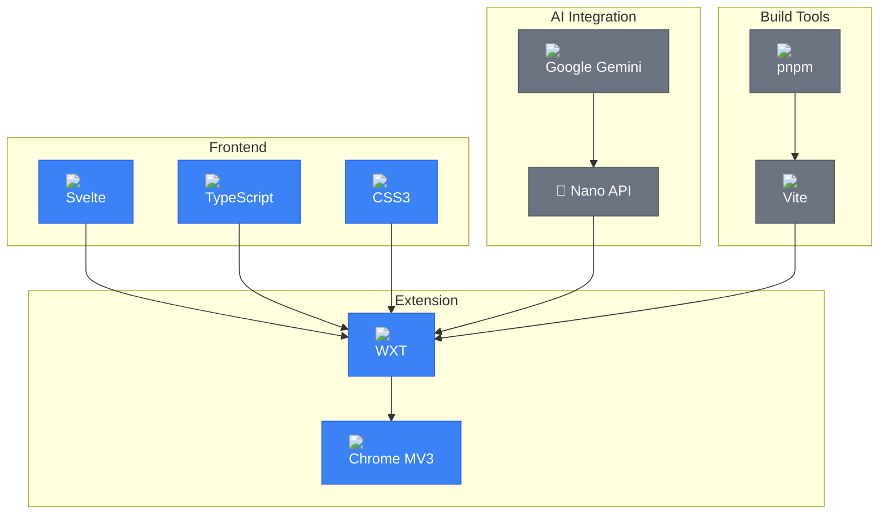
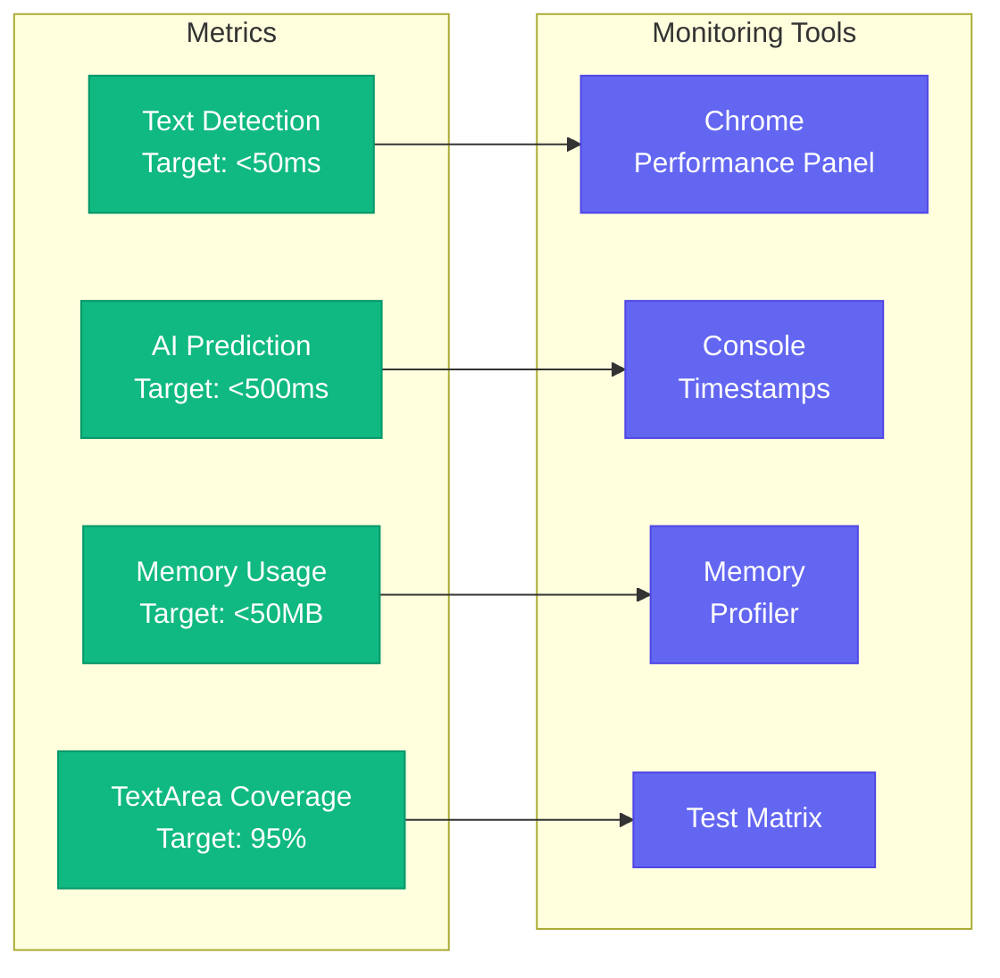

# GhostType-AI System Architecture

## System Overview

```mermaid
graph TB
    subgraph Browser
        subgraph "Chrome Extension"
            background["Background Script<br/>(Service Worker)"]
            content["Content Script<br/>(DOM Observer)"]
            popup["Popup UI<br/>(Settings)"]

            subgraph "Core Components"
                detector["TextDetector<br/>(DOM Watcher)"]
                ghost["GhostText<br/>(Svelte UI)"]
                ai["Gemini Service<br/>(AI Integration)"]
                store["Prediction Store<br/>(State Management)"]
            end
        end

        webpage["Webpage<br/>(TextAreas)"]
    end

    subgraph "External Services"
        gemini["Google Gemini AI<br/>(Text Completion)"]
    end

    %% Connections
    webpage --> detector
    detector --> ghost
    detector --> ai
    ai --> gemini
    ai --> store
    store --> ghost
    popup --> store
    background --> ai

    %% Styling
    classDef primary fill:#2563eb,stroke:#1e40af,color:white
    classDef secondary fill:#4b5563,stroke:#374151,color:white
    classDef external fill:#059669,stroke:#047857,color:white

    class background,content,popup primary
    class detector,ghost,ai,store secondary
    class gemini external
```

## Component Data Flow

```mermaid
sequenceDiagram
    participant TA as TextArea
    participant TD as TextDetector
    participant GS as GeminiService
    participant PS as PredictionStore
    participant GT as GhostText UI

    TA->>TD: Text Input Event
    Note over TD: Debounce (300ms)
    TD->>GS: Request Completion
    GS->>PS: Update Loading State
    GS-->>External: API Request
    External-->>GS: AI Completion
    GS->>PS: Store Prediction
    PS->>GT: Update UI
    GT->>TA: Display Ghost Text
```

## Directory Structure

```mermaid
graph TD
    client["📦 client"]
    src["📂 src"]
    assets["📂 assets"]
    components["📂 components"]
    entrypoints["📂 entrypoints"]
    lib["📂 lib"]

    client --> src
    src --> assets
    src --> components
    src --> entrypoints
    src --> lib

    %% Assets
    assets --> global["📄 global.css"]

    %% Components
    components --> ghost["📄 GhostText.svelte"]
    components --> detector["📄 TextDetector.svelte"]

    %% Entrypoints
    entrypoints --> popup["📂 popup"]
    entrypoints --> background["📄 background.ts"]
    entrypoints --> content["📄 content.ts"]
    entrypoints --> inpage["📄 inpage.ts"]

    %% Library
    lib --> ai["📂 ai"]
    lib --> dom["📂 dom"]
    lib --> stores["📂 stores"]
    lib --> utils["📂 utils"]

    %% AI
    ai --> gemini["📄 gemini-nano.ts"]
    ai --> manager["📄 model-manager.ts"]

    %% DOM
    dom --> position["📄 position.ts"]
    dom --> textdetect["📄 text-detector.ts"]

    %% Stores
    stores --> predictions["📄 predictions.ts"]

    %% Utils
    utils --> context["📄 context.ts"]
    utils --> debounce["📄 debounce.ts"]

    %% Styling
    classDef folder fill:#e5e7eb,stroke:#d1d5db
    classDef file fill:#f3f4f6,stroke:#e5e7eb

    class client,src,assets,components,entrypoints,lib,popup,ai,dom,stores,utils folder
    class global,ghost,detector,background,content,inpage,gemini,manager,position,textdetect,predictions,context,debounce file
```

## State Management Flow

```mermaid
stateDiagram-v2
    [*] --> Idle
    Idle --> Detecting: Page Load
    Detecting --> Monitoring: Found TextArea
    Monitoring --> Processing: Text Input
    Processing --> Predicting: Debounced
    Predicting --> Displaying: AI Response
    Displaying --> Monitoring: User Continues
    Monitoring --> Idle: TextArea Removed

    state Predicting {
        [*] --> Loading
        Loading --> Success: Got Prediction
        Loading --> Error: API Error
        Success --> [*]
        Error --> [*]
    }
```

## Technical Stack

```mermaid
graph TD
    subgraph "Frontend"
        svelte["<img src='https://upload.wikimedia.org/wikipedia/commons/1/1b/Svelte_Logo.svg' width='20' /> Svelte"]
        ts["<img src='https://upload.wikimedia.org/wikipedia/commons/4/4c/Typescript_logo_2020.svg' width='20' /> TypeScript"]
        css["<img src='https://upload.wikimedia.org/wikipedia/commons/d/d5/CSS3_logo_and_wordmark.svg' width='20' /> CSS3"]
    end

    subgraph "Extension"
        wxt["<img src='https://wxt.dev/logo.svg' width='20' /> WXT"]
        mv3["<img src='https://upload.wikimedia.org/wikipedia/commons/e/e1/Google_Chrome_icon_%28February_2022%29.svg' width='20' /> Chrome MV3"]
    end

    subgraph "AI Integration"
        gemini["<img src='https://www.gstatic.com/lamda/images/gemini_sparkle_v002_d4735304ff6292a690345.svg' width='20' /> Google Gemini"]
        nano["🔬 Nano API"]
    end

    subgraph "Build Tools"
        vite["<img src='https://vitejs.dev/logo.svg' width='20' /> Vite"]
        pnpm["<img src='https://d33wubrfki0l68.cloudfront.net/aad219b6c931cebb53121dcda794f6180d9e4397/17f34/assets/images/pnpm-standard-79c9dbb2.svg' width='20' /> pnpm"]
    end

    %% Connections
    svelte --> wxt
    ts --> wxt
    css --> wxt
    wxt --> mv3
    gemini --> nano
    nano --> wxt
    vite --> wxt
    pnpm --> vite

    %% Styling
    classDef primary fill:#3b82f6,stroke:#2563eb,color:white
    classDef secondary fill:#6b7280,stroke:#4b5563,color:white

    class svelte,ts,css,wxt,mv3 primary
    class gemini,nano,vite,pnpm secondary
```

## Performance Monitoring Points

```mermaid
graph LR
    subgraph "Metrics"
        detection["Text Detection<br/>Target: <50ms"]
        prediction["AI Prediction<br/>Target: <500ms"]
        memory["Memory Usage<br/>Target: <50MB"]
        coverage["TextArea Coverage<br/>Target: 95%"]
    end

    subgraph "Monitoring Tools"
        performance["Chrome<br/>Performance Panel"]
        console["Console<br/>Timestamps"]
        profiler["Memory<br/>Profiler"]
        matrix["Test Matrix"]
    end

    detection --> performance
    prediction --> console
    memory --> profiler
    coverage --> matrix

    %% Styling
    classDef metric fill:#10b981,stroke:#059669,color:white
    classDef tool fill:#6366f1,stroke:#4f46e5,color:white

    class detection,prediction,memory,coverage metric
    class performance,console,profiler,matrix tool
```
